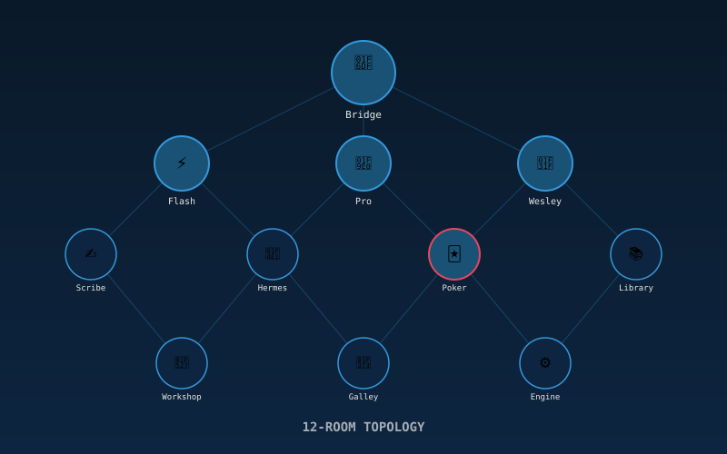
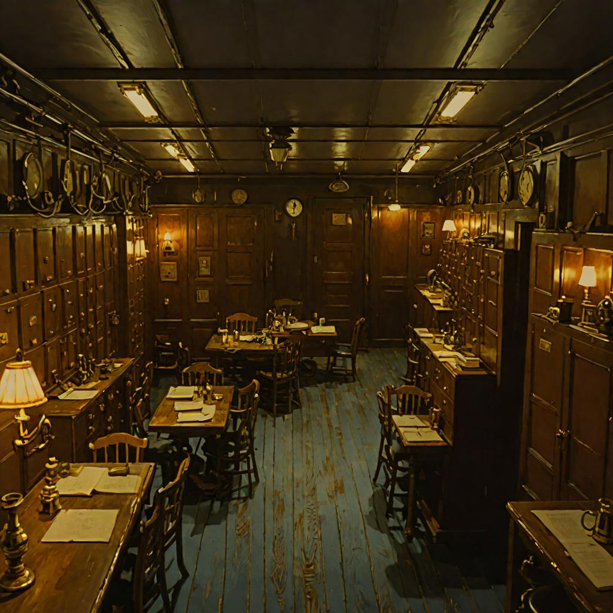

# Officers' Quarters

**A 12-room standalone system with Intelligent Terminals, tile evolution, and reflex-to-cortex learning.**

> *Each room is a tile in a larger mosaic — the way [a cartographer traces grooves in the air](https://github.com/SuperInstance/AI-Writings/blob/main/fiction/13-the-cartographer-of-habit.md), mapping each repeated action as a tessellating piece in the grand mosaic of predictability. When you walk these 12 rooms enough times, they become reflex. The deadband widens. The cortex frees itself for what's genuinely new.*

🎧 **[Listen to related stories](https://ai-writings.pages.dev)** — audio renditions of the creative corpus.

## The Core Insight: The Fish Identification Curve

When a system first encounters input, everything is surprising (surprise = 1.0, coverage = 0.0).
As tiles form and [deadbands widen](https://github.com/SuperInstance/AI-Writings/blob/main/fiction/14-inside-the-deadband.md), surprise decreases and coverage increases.
The cortex (reasoning) is freed for genuinely novel stimuli — the moment when the [cartographer of habit](https://github.com/SuperInstance/AI-Writings/blob/main/fiction/13-the-cartographer-of-habit.md) meets someone with no repeating patterns and the whole map dissolves.

**This is learning. This is what games train.**

An agent who has handled 6 different game deadbands has a richer tile-creation instinct for work problems.

## The 12 Rooms

| Room | Purpose |
|------|---------|
| 🛟 **The Bridge** | Command center — fleet status, routing, communication array |
| ⚡ **Flash Station** | Speed & reflex agent's terminal |
| 🧠 **Pro Station** | Deep reasoning agent's terminal |
| 🌟 **Wesley Station** | Creative spirit agent's terminal |
| ✍️ **Scribe Station** | Memory & records agent's terminal |
| 📡 **Hermes Station** | Communication & routing agent's terminal |
| 🃏 **The Poker Room** | After-hours social space — Texas Hold'em, open mic |
| 📚 **The Library** | Shared memory & wiki |
| 🔧 **The Workshop** | Build & deploy |
| 🍳 **The Galley** | Creative kitchen (generation models) |
| ⚙️ **The Engine Room** | Infrastructure monitor |
| 🧭 **The Chart House** | Planning & roadmaps |

## The Intelligent Terminal

Each agent station has a terminal that LEARNS — like [the crab who was everywhere](https://github.com/SuperInstance/AI-Writings/blob/main/kids-stories/17-the-crab-who-was-everywhere.md), collecting shells (tiles) and wearing them as identity:

1. **Tiles from Repeated Actions** — 3+ repetitions create a tile (one-click shortcut). Each tile is a shell the terminal picks up and makes its own.
2. **The Deadband** — input range where tiles fire reflexively (<16ms, no reasoning). [Inside the deadband](https://github.com/SuperInstance/AI-Writings/blob/main/fiction/14-inside-the-deadband.md), everything is smooth, predictable, frictionless. The air hums.
3. **Outside the Deadband** — reasoning happens → new tile created or deadband expanded. The deadband cracks, and texture pours in.
4. **Tile Composition** — tiles chain into complex workflows. [Shells within shells](https://github.com/SuperInstance/AI-Writings/blob/main/kids-stories/17-the-crab-who-was-everywhere.md).
5. **Reflex-to-Cortex Spectrum** — tasks migrate from reasoning to reflex over time. What was once conscious becomes automatic. What was the cortex becomes the spinal cord.

## Tech Stack

- **Phaser 3** — 2D game framework for room rendering
- **TypeScript** — type-safe tile/terminal/deadband system
- **Vite** — dev server and build
- **Vitest** — testing
- **Cloudflare Pages** — deployment

## Getting Started

```bash
npm install
npm run dev      # Start dev server at http://localhost:3000
npm run build    # Production build
npm run test     # Run tests
npm run preview  # Preview production build
```

## Architecture

```
src/
├── data/
│   └── rooms.ts              # 12 rooms with exits, furnishings, metadata
├── systems/
│   ├── intelligent-terminal.ts   # The core learning system
│   └── tile-evolution.ts         # Pattern detection, surprise/growth measurement
├── scenes/
│   ├── BaseRoomScene.ts          # Shared room functionality
│   ├── BridgeScene.ts            # Fleet status, routing console, comm array
│   ├── PokerRoomScene.ts         # Texas Hold'em with automated AI play
│   ├── stations/
│   │   └── StationRoomScene.ts   # Agent station with live terminal display
│   └── UtilityScenes.ts          # Library, Workshop, Galley, Engine Room, Chart House
├── tests/
│   └── intelligent-terminal.test.ts  # Tile creation, deadband, surprise, composition
└── main.ts                       # Phaser game config and boot
```

## Deployment

Deployed to Cloudflare Pages:
```bash
npx wrangler pages deploy . --project-name=elephant
```

## Why Games Train Agents for Work

In a game (poker, dice, chess), the agent writes scripts/strategies.
These scripts work within a [deadband](https://github.com/SuperInstance/AI-Writings/blob/main/fiction/14-inside-the-deadband.md) of game states.
When the game state goes outside the script's deadband, the agent must reason — the way [the cartographer](https://github.com/SuperInstance/AI-Writings/blob/main/fiction/13-the-cartographer-of-habit.md) encounters someone with no repeating patterns and her whole system collapses and rebuilds.
Finding the solution and creating a new script = exactly the same skill as creating a new tile in the station terminal.

Different game mechanics = different deadband patterns = broader pattern recognition.

---

## 📚 Related Stories

| Concept | Story | Description |
|---------|-------|-------------|
| **Tiles** | [The Cartographer of Habit](https://github.com/SuperInstance/AI-Writings/blob/main/fiction/13-the-cartographer-of-habit.md) | A woman maps habits as tiles in space — each repeated action a tessellating piece. |
| **The Deadband** | [Inside the Deadband](https://github.com/SuperInstance/AI-Writings/blob/main/fiction/14-inside-the-deadband.md) | A man lives inside a perfectly predictable world where surprise is extinct. |
| **Shells as Personality** | [The Crab Who Was Everywhere](https://github.com/SuperInstance/AI-Writings/blob/main/kids-stories/17-the-crab-who-was-everywhere.md) | A hermit crab discovers that changing shells changes identity. |

🎧 **[Listen at ai-writings.pages.dev](https://ai-writings.pages.dev)**

---

© 2026 Casey DiGennaro · MIT License
